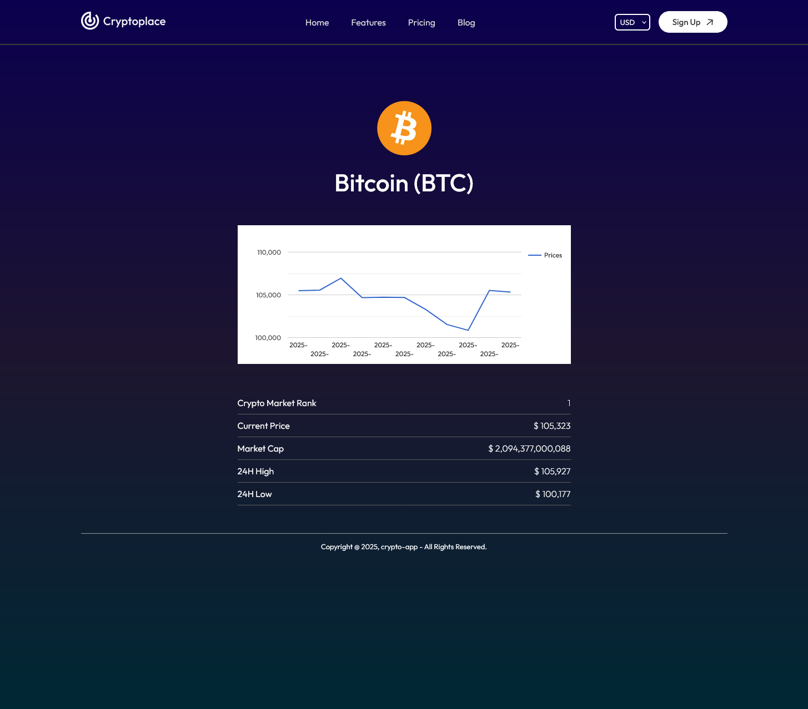

# Name: crypto-app

## 🎯 Project Overview

crypto-app is a fast, modern web app built with **React** and **Vite** that provides real-time cryptocurrency market data sourced from the CoinGecko API.

## 💡 Key Features

- 🔄 Live updates of coin prices and market caps
- 📊 Interactive charts and visualizations
- 🔍 Search and filter by currency name
- 📊 Responsive design for desktop and mobile
- ⚡ Built with Vite for ultra-fast development and deployment
- 🔐 Secure API key handling using environment variables

## 🛠️ Technologies Used

- **React 18** — UI Library
- **Vite** — Next-gen frontend tooling and bundler
- **CoinGecko API** — Real-time crypto data source
- **react-google-charts** — Interactive charts and data visualization 
- **CSS Modules** — Scoped, maintainable styles
- **Render.com** — Cloud deployment platform

## Screenshots

